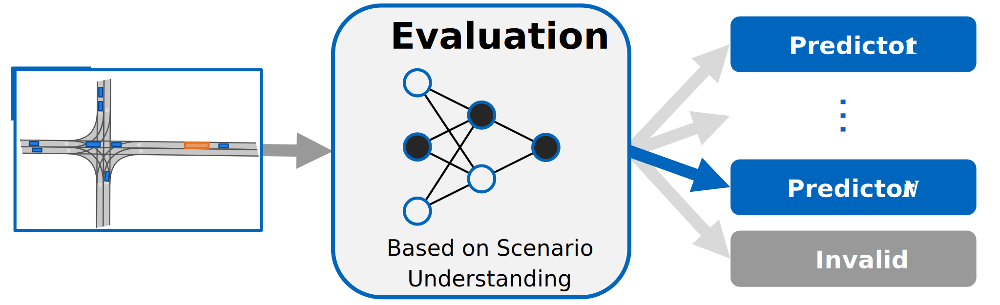
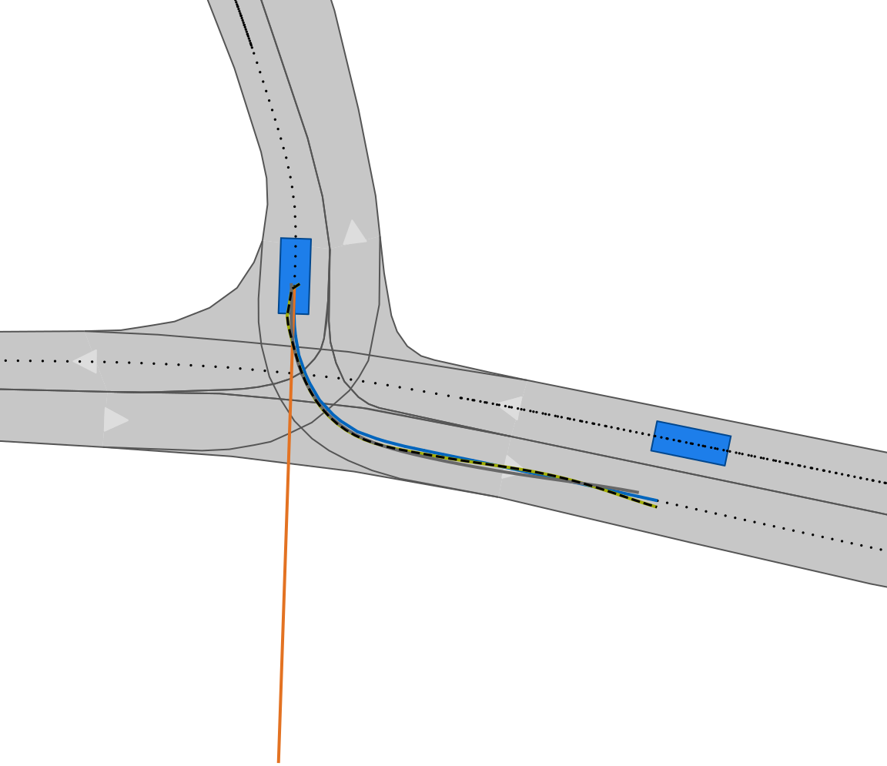

[](https://doi.org/10.5281/zenodo.8389903)
[](https://www.linux.org/)
[](https://www.python.org/downloads/release/python-380/)

# Self-Evaluation of Trajectory Predictors for Autonomous Driving



Driving experience and anticipatory driving are essential for humans to operate vehicles in complex environments. In the context of autonomous vehicles, scenario understanding and motion prediction are the respective tasks the software has to fulfill. The latter task of motion prediction is extensively researched with several competitions on large data sets, and established methods provide promising results.
However, the incorporation of scenario understanding has been sparsely investigated yet. It comprises two aspects. First, by means of scenario understanding, individual assumptions of an object's behavior can be derived to adaptively predict its future motion. Second, scenario understanding enables the detection of challenging scenarios for the autonomous vehicle software to prevent safety-critical situations. Therefore, we propose a method that incorporates scenario understanding into the task of motion prediction to improve adaptivity and avoid prediction failures. This is realized by an a priori evaluation of the scenario based on semantic information. The evaluation adaptively selects the most accurate prediction model but also recognizes if no model is capable of accurately predicting this scenario and high prediction errors are expected. The results on the comprehensive scenario library CommonRoad reveal a decrease of the Euclidean prediction error by 81.0 % and a 90.8 % reduction in mispredictions of our method compared to the benchmark model.

### Requirements
- OS: `Ubuntu 22.04 LTS`
- Python: `3.8`

## Installation

Clone repository:
```
git clone https://github.com/TUMFTM/SETRIC.git
```

Setup virtual environment and install requirements:
```
python3.8 -m venv venv
source venv/bin/activate

pip install --upgrade pip setuptools 
pip install wheel==0.41.2 --no-cache-dir
pip install -r ./requirements.txt --no-cache-dir  
```

[Optional] Install tex extensions, necessary to plot with desired font:
```
sudo apt-get install texlive-latex-extra texlive-fonts-recommended dvipng cm-super
```


## Data
The current evaluation is conducted on [CommonRoad](https://commonroad.in.tum.de/). The raw data of all scenarios is given in the [CommonRoad-Repository](https://gitlab.lrz.de/tum-cps/commonroad-scenarios). The processed data used in this research is available open-source ([Link](https://doi.org/10.5281/zenodo.8389720), uncompressed size: 89.3 GB). The data processing is realized by the script [Dataset_CR.py](utils/Dataset_CR.py). For further information about the data processing, including the usage of the [OpenDD](https://l3pilot.eu/data/opendd) Dataset as second data source, please check [README](data/README.md) in `data`.

## Parameter and Files
### Directory: `setric`
The directory `setric` contains the code to run the training, optimization and evaluation of the FusionModel. 

| Files | Description |
| ------------------ | ----------------------- |
`bayesian_optimization_selector.py` | Bayesian optimization of the selector only
`bayesian_optimization.py` | Bayesian optimization of the single predictors and the selector
`evaluate_fusion.py` | Evaluation of the trained FusionModel on the test data for one fixed error threshold
`evaluate_variation.py` | Evaluation (incl. visualization) of multiple FusionModel with different error thresholds of the selector
`main_fusion.py` | Main file to train the FusionModel

### Directory: `models`
The directory `models` contains all prediction models and the respective submodules (folder: `modules`). The FusionModel, which incorporates multiple submodels (CV, LSTM, Graph-LSTM), and the single predictors models are implemented. Thus, it possible to evaluate the fused model as well as the single predictors or to create new fusion models.

| Files | Description |
| ------------------ | ----------------------- |
`CV_Model.py` | Constant Velocity Trajectory Prediction
`D_GNN_LSTM_Model.py` | Trajectory Prediction based on proximity-dependent Graph-NN
`Fusion_Model.py` | The main implementation of SETRIC, which incorporates a CV, a L_LSTM, a DG_LSTM and a selector model with optimized usage of the net branches and scene image encoding.
`LSTM_Model.py` | Vanilla LSTM Model for Trajectory Prediction
`LSTMindy_Model.py` | Indy LSTM Model for Trajectory Prediction
`model_utils.py` | CostumModel classes, which is the parent class of all models

### Directory: `utils`
The directory `utils` contains the code to create the data sets and helper files for training and data processing.

| Files | Description |
| ------------------ | ----------------------- |
`Dataset_CR.py` | Class of [CommonRoad](https://commonroad.in.tum.de/) Dataset
`Dataset_OpenDD.py` | Class of [OpenDD](https://l3pilot.eu/data/opendd) Dataset
`render_cr.py`| Rendering of commonroad-scenarios (png, gif, mp4) to visualize scenarios with the prediction of a trained model

## Model
The model used in this research is given in [FusionModel.py](models/Fusion_Model.py). All parameters of its architecture are specified in the [net_config.json](config/net_config.json). The training parameters are given in [train_config.json](config/train_config.json). See the [README](config/README.md) for the explanation of the parameters. 

### Training
To train a new model, the script [main_fusion.py](setric/main_fusion.py) can be used, note to pass the desired arguments to the script for the training. 

### Trained models
The open source repo offers the trained model parameters ([Link](results/cr_fusion_08/cr/g_fusion_g_sel/10/model_parameters_10.pth.tar)) for a threshold of 0.6221 m (80%-percentile of the error of the single predictors). In addition, the base training is given ([Link](results/cr_fusion_base/cr/g_fusion_dg_lstm/10/model_parameters_10.pth.tar)), which was used as input for the optimization of the `08_model`.

### Model execution
For an exemplary usage of the model including visualization on CommonRoad-scenarios, the file [render_cr.py](utils/render_cr.py) can be used. It creates pictures and videos of the scenarios. The argument `all_pred` visualizes also the non-selected prediction, besides the selected one. The argument `get_pred_samples` runs the model on the scenarios, outputs all prediction and zooms in to the current target model for in-detail analysis.


## Qualitative Example
Below is an exemplary visualization of the given implementation of SETRIC, the FusionModel for one object. The selector chooses based on the given scenario the best predictor (black dashed line) to optimize the prediction accuracy for every object. To show the benefits of the scenario-based selection, the further predictors are additionally visualized. It can be seen that the choice of the selector significantly improves the prediction accuracy compared to the CV-model (orange), which could have been another option of the model. The L_LSTM-model (gray) is an nearly equal choice, but falls short to the end of the prediction horizon. Ground Truth is shown in blue.



## References
Phillip Karle, Lukas Furtner, and Markus Lienkamp "Self-Evaluation of Trajectory Predictors for Autonomous Driving" (under review)
